# DevForge Architecture

This document describes the architectural layout, communication patterns, and design details of the DevForge local developer platform.

---

## 1. Network Topology

The network configuration ensures isolation while enabling service discovery via service name matching.

```mermaid
graph TD
    Client[Host Machine / Browser] -->|Port 80/443| Ingress[Nginx Ingress Proxy]
    subgraph DevForge Network
        Ingress -->|Proxy Pass| WebUI[Open WebUI]
        Ingress -->|Proxy Pass| Ollama[Ollama LLM Engine]
        Ingress -->|Proxy Pass| Chroma[ChromaDB Vector DB]
        Ingress -->|Proxy Pass| Qdrant[Qdrant Search Engine]
        Ingress -->|Proxy Pass| Neo4j[Neo4j Graph Database]
        
        WebUI -->|Internal Link| Ollama
        
        Workspace[VS Code Dev Container] -->|Internal Port Connect| Postgres[PostgreSQL]
        Workspace -->|Internal Port Connect| Mongo[MongoDB]
        Workspace -->|Internal Port Connect| Redis[Redis Cache]
        Workspace -->|Internal Port Connect| Neo4j
        Workspace -->|Internal Port Connect| Chroma
        Workspace -->|Internal Port Connect| Qdrant
        
        React[React - Vite] -->|Database Connections| Postgres
        NextJS[Next.js - App Router] -->|Database Connections| Mongo
        Express[Express API] -->|Database Connections| Redis
        NestJS[NestJS API] -->|Database Connections| Neo4j
        FastAPI[FastAPI API] -->|Database Connections| Postgres
        Flask[Flask API] -->|Database Connections| Mongo
        Django[Django App] -->|Database Connections| Postgres
        Jupyter[JupyterLab] -->|Database Connections| Mongo
        AI[AI Dev API] -->|AI Queries| Ollama
        AI -->|Vector Search| Chroma
        AI -->|Vector Search| Qdrant
        SpringBoot[Spring Boot App] -->|Database Connections| Postgres
        Flutter[Flutter Mobile Builder] -.->|Host ADB USB Bridge| PhysicalDevice[Physical Android Phone]
    end
```

### Key Principles:
* **Service Names**: Containers address each other solely through service names (e.g., `http://ollama:11434` or `postgresql://postgres:5432`).
* **Ingress Access**: Nginx exposes port 8080 (mapped to port 80 on host) to provide paths like `/webui/` or `/qdrant/` for a unified development URL.

---

## 2. Storage & Persistence

Data is isolated using named volumes defined at the bottom of `docker-compose.yml`:
* `devforge_pgdata`: Bound to PostgreSQL's `/var/lib/postgresql/data`.
* `devforge_mongodata`: Bound to MongoDB's `/data/db`.
* `devforge_redisdata`: Bound to Redis' `/data`.
* `devforge_neo4jdata`: Bound to Neo4j's `/data`.
* `devforge_qdrantdata`: Bound to Qdrant's `/qdrant/storage`.
* `devforge_chromadata`: Bound to ChromaDB's `/chroma/data`.
* `devforge_ollamadata`: Bound to Ollama's `/root/.ollama` (stores large LLM model weights).
* `devforge_react_node_modules`: Dynamic named volume for React package cache.
* `devforge_nextjs_node_modules`: Dynamic named volume for Next.js package cache.
* `devforge_express_node_modules`: Dynamic named volume for Express package cache.
* `devforge_nestjs_node_modules`: Dynamic named volume for NestJS package cache.
* `devforge_m2data`: Named volume for Maven package dependencies cache.
* `devforge_gradle_cache`: Named volume for Android/Gradle build cache.

---

## 3. Security Hardening

To ensure container runs adhere to security standards, we apply:
1. **Root Privilege Drop**: Custom Dockerfiles configure user directives (`USER redis`, `USER nginx`, etc.).
2. **Linux Capability Restrictions**: Unneeded root powers are dropped using `cap_drop: [ALL]`. Required features (like `CHOWN` or `DAC_OVERRIDE` on Postgres) are added explicitly.
3. **Read-Only Root Filesystems**: Where supported (e.g., Nginx, Redis), directories are mounted read-only and `tmpfs` is used for ephemeral folders like `/tmp` or `/run`.
4. **No Privilege Escalation**: Enabled `security_opt: [no-new-privileges:true]` to block processes from gaining additional privileges.
