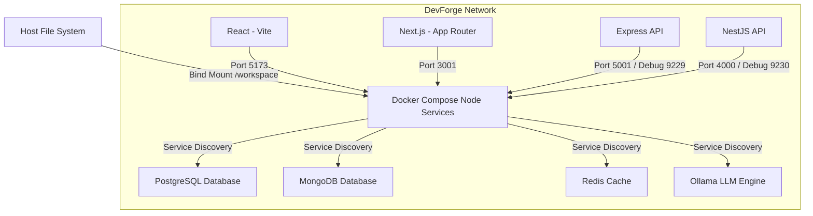

# DevForge Node.js Development Platform Documentation

This document describes the Node.js development platform integrated into the DevForge workspace. The platform provides production-ready, containerized environments for React, Next.js, Express, and NestJS, featuring instant hot-reloading, VS Code breakpoint debugging, and automated project setup.

---

## 1. Architecture

The Node.js platform is designed around a single, reusable custom development image that contains the entire development toolchain.



### Key Components

- **Base Image**: Built from [docker/node/Dockerfile](file:///D:/Coding/DevForge/docker/node/Dockerfile), containing Node.js 22 LTS, npm, yarn, pnpm, TypeScript, and developer tools (zsh, git, curl, zip, vim, nano).
- **Service Isolation**: Services run independently and communicate over the internal `devforge-network` bridge.
- **Dependency Isolation**: To bypass slow host-mount performance (especially on Windows) and architecture collisions, the `node_modules` folders are stored inside high-performance named Docker volumes:
  - `devforge_react_node_modules`
  - `devforge_nextjs_node_modules`
  - `devforge_express_node_modules`
  - `devforge_nestjs_node_modules`

---

## 2. Folder Layout

The Node.js platform extends the workspace with the following directories:

```text
DevForge/
├── .vscode/
│   └── launch.json            # VS Code attach/launch debug configurations
├── docker/
│   └── node/
│       └── Dockerfile         # Reusable Node.js 22 LTS development image
├── templates/
│   ├── shared/                # Shared settings (Prettier, base tsconfig)
│   ├── react/                 # React + Vite starter template
│   ├── nextjs/                # Next.js App Router template
│   ├── express/               # Express + TypeScript template
│   └── nestjs/                # NestJS starter template
├── projects/
│   ├── sample-react/          # Active sample React project
│   ├── sample-nextjs/         # Active sample Next.js project
│   ├── sample-express/        # Active sample Express project
│   └── sample-nestjs/         # Active sample NestJS project
└── scripts/
    ├── create-react.sh        # React project generator script
    ├── create-nextjs.sh       # Next.js project generator script
    ├── create-express.sh      # Express project generator script
    ├── create-nestjs.sh       # NestJS project generator script
    ├── install-deps.sh        # Dynamic package installer script
    ├── clean-caches.sh        # Build and cache purger script
    └── update-packages.sh     # Package updater script
```

---

## 3. Development Workflow

### Creating a Project

To spin up a new project, use the corresponding Makefile target. This copies the starter template into a designated subdirectory in `projects/` and pre-configures files like `.env`.

- **React**: `make create-react name=my-app`
- **Next.js**: `make create-next name=my-app`
- **Express**: `make create-express name=my-app`
- **NestJS**: `make create-nest name=my-app`

### Running Projects

Manage your containers using the global DevForge docker-compose configuration.

- **Start all Node environments**:
  ```bash
  make up
  ```
- **Restart a specific environment**:
  ```bash
  docker compose restart express
  ```
- **Stop services**:
  ```bash
  make down
  ```

### Installing Dependencies

When containers boot for the first time, they automatically execute `npm install` inside their designated directories to populate the named volumes. If you need to manually install new packages:

- **Install in all services**:
  ```bash
  make install
  ```
- **Install in a specific service**:
  ```bash
  make install SERVICE=react
  ```

---

## 4. Hot Reload

The templates are pre-configured to handle file updates across host operating systems and Docker environments:

1. **Vite (React)**:
   Configured in [projects/sample-react/vite.config.ts](file:///D:/Coding/DevForge/projects/sample-react/vite.config.ts) to listen on all interfaces and run with polling enabled:
   ```typescript
   server: {
     host: '0.0.0.0',
     port: 5173,
     watch: { usePolling: true },
     hmr: { clientPort: 5173 }
   }
   ```
2. **Next.js**:
   Configured in [projects/sample-nextjs/next.config.mjs](file:///D:/Coding/DevForge/projects/sample-nextjs/next.config.mjs) with dev polling options:
   ```javascript
   webpack: (config, { dev }) => {
     if (dev) {
       config.watchOptions = { poll: 1000, aggregateTimeout: 300 };
     }
     return config;
   }
   ```
3. **Express & NestJS**:
   - Express utilizes `nodemon` with `--legacy-watch` inside [projects/sample-express/nodemon.json](file:///D:/Coding/DevForge/projects/sample-express/nodemon.json).
   - NestJS uses built-in webpack compiler watch tasks running inside Docker.

---

## 5. Debugging

DevForge supports source-mapped, breakpoint debugging inside VS Code.

### Debug Configuration

The debugging profiles are defined in [.vscode/launch.json](file:///D:/Coding/DevForge/.vscode/launch.json):

1. **Attach to Express (Docker)**: Connects to Node Inspector running on port `9229`.
2. **Attach to NestJS (Docker)**: Connects to Node Inspector running on port `9230` (mapped to internal `9229`).
3. **Debug React in Chrome**: Launches a Chrome browser session targeting the hot-reloaded Vite server.
4. **Debug Next.js in Chrome**: Launches a Chrome browser session targeting the hot-reloaded Next.js server.

### Adding Breakpoints

1. Open a source file (e.g., [projects/sample-express/src/index.ts](file:///D:/Coding/DevForge/projects/sample-express/src/index.ts)).
2. Click in the margin to add a breakpoint.
3. Select the debugging profile from the VS Code Run & Debug tab and press `F5` to attach.
